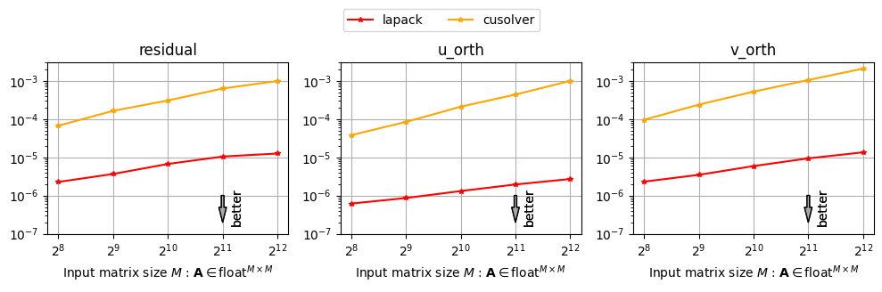

# Comparison between cuSOLVER sgesvdj and LAPACK sgesvj

## Build
```bash
git clone https://github.com/enp1s0/cusolver-sgesvdj-eval --recursive
cd cusolver-sgesvdj-eval
make -j
```

## Run
```bash
./cusolver-svdj.test
```

## Result



## License
MIT
